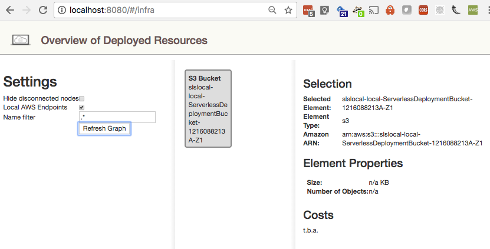

========
 README
========

Installing core and virtualenv
==============================

::
   nvm use default
   Now using node v9.2.0 (npm v5.5.1)

   npm init
   npm install --save-dev serverless
   npm install --save-dev serverless-localstack

   pyenv local 3.6.3
   virtualenv .venv3
   source .venv3/bin/activate
   pip install localstack

Create a Serverless project
===========================

   sls create --template aws-python3 --path slslocal --name slslocal
   cd sls local

Start Localstack
================

On Mac we have to avoid TMPDIR symlink docker can't mount::

   TMPDIR=/private$TMPDIR localstack start --docker

There's now a web viewer on http://localhost:8080 and it shows (at
this point in the execution) that the Serverless deployment bucket was
created -- pretty cool.

UPDATE: docker threw errors I couldn't understand; trying to run
locally threw error about not finding python2. Created separate dir
for localstack with python2 venv then non-docker localstack
started. Ran wihtout docker. In serverless dir set AWS_PROFILE then
ran "sls deploy --stage local"::

  2018-02-07T16:56:42:ERROR:localstack.services.generic_proxy: Error forwarding request: list index out of range Traceback (most recent call last):
    File "/Users/chris/Projects/vstudios/slslocal/localstack/.venv2/lib/python2.7/site-packages/localstack/services/generic_proxy.py", line 215, in forward
      updated_response = self.proxy.update_listener.return_response(**kwargs)
    File "/Users/chris/Projects/vstudios/slslocal/localstack/.venv2/lib/python2.7/site-packages/localstack/services/cloudformation/cloudformation_listener.py", line 183, in return_response
      template_deployer.deploy_template(template, req_data.get('StackName')[0])
    File "/Users/chris/Projects/vstudios/slslocal/localstack/.venv2/lib/python2.7/site-packages/localstack/utils/cloudformation/template_deployer.py", line 485, in deploy_template
      resource['__details__'] = stack_resources[0]
  IndexError: list index out of range

Try with "localstack start --docker" and same sls invocation, where I
do get a web console::

  sls reports the same::

      at serverless.init.then (/Users/chris/Projects/vstudios/slslocal/slslocal/node_modules/serverless/bin/serverless:42:50)

 but we get no logging or other output from Docker... because it's
 sealed inside docker.

 When I deploy to AWS (not using --stage dev for localstack) it fails
 creating my bucket with even is not supported for notification; I
 wrote "s3:ObjectCreated:\*" instead of "s3:ObjectCreated:\*"

It deploys to AWS successfully, but still fails on localstack.

localstack
==========

Fails with python3
------------------

Cannot install localstack with pyenv and python3::

  pyenv local 3.6.3
  virtualenv .venv3
  source .venv3/bin/activate
  install localstack

  ERROR: Command 'cd "/Users/chris/Projects/vstudios/slslocalstack/.venv3/lib/python3.6/site-packages/localstack" && npm install' returned non-zero exit status 1.

If I do that manually, I get details::

  prebuild-install WARN install No prebuilt binaries found (target=9.2.0 runtime=node arch=x64 platform=darwin)
  gyp ERR! configure error 
  gyp ERR! stack Error: Command failed: /Users/chris/.pyenv/shims/python2 -c import platform; print(platform.python_version());
  gyp ERR! stack pyenv: python2: command not found
  gyp ERR! stack 
  gyp ERR! stack The `python2' command exists in these Python versions:
  gyp ERR! stack   2.7.14

Try python2
-----------

Using pyenv and python2::

  pyenv local 2.7.14
  virtualenv .venv2
  source .venv2/bin/activate
  pip install localstack

Run with py2 locally (not docker)
---------------------------------

Start it without docker::

  DATA_DIR=/tmp/localstack/data PORT_WEB_UI=8888 localstack start
  Starting mock API Gateway (http port 4567)...
  #...
  2018-02-07T17:38:05:WARNING:infra.pyc: Service "elasticsearch" not yet available, retrying...
  Ready.

It doesn't say anything about a web console on 8888 :-(
We do see the data dir.

Deploy serverless::

  SLS_DEBUG="*" ./sls deploy --stage local

  at Serverless.run (/Users/chris/Projects/vstudios/slslocal/slslocal/node_modules/serverless/lib/Serverless.js:89:74)
  at serverless.init.then (/Users/chris/Projects/vstudios/slslocal/slslocal/node_modules/serverless/bin/serverless:42:50)
  at <anonymous>

The localstack reported the error::

  2018-02-07T17:42:48:ERROR:localstack.services.generic_proxy: Error forwarding request: list index out of range Traceback (most recent call last):
  File "/Users/chris/Projects/vstudios/slslocalstack/.venv3/lib/python3.6/site-packages/localstack/.venv2/lib/python2.7/site-packages/localstack/services/generic_proxy.py", line 215, in forward
    updated_response = self.proxy.update_listener.return_response(**kwargs)
  File "/Users/chris/Projects/vstudios/slslocalstack/.venv3/lib/python3.6/site-packages/localstack/.venv2/lib/python2.7/site-packages/localstack/services/cloudformation/cloudformation_listener.py", line 183, in return_response
    template_deployer.deploy_template(template, req_data.get('StackName')[0])
  File "/Users/chris/Projects/vstudios/slslocalstack/.venv3/lib/python3.6/site-packages/localstack/.venv2/lib/python2.7/site-packages/localstack/utils/cloudformation/template_deployer.py", line 485, in deploy_template
    resource['__details__'] = stack_resources[0]
  IndexError: list index out of range

